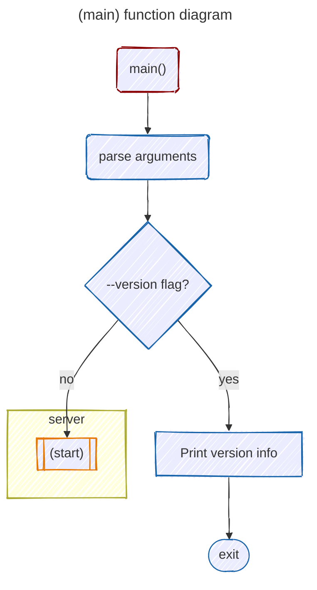

# `__main__.py` function diagrams and documentation

Hyuga's entry point is the [`main`](/hyuga/__main__.py#L7) function in [`__main__.py`](/hyuga/__main__.py).

That function, which is called at the bottom of `__main__/py` (only if `__name__` = `"__main__"`), parses command line arguments using `argparse` and checks whether the `--version` flag has been passed to the program at the command line. 
    If so, it prints a version string and exits.
    Otherwise, it calls the [`start`](/hyuga/server.hy#114) function from [`server.hy`](/hyuga/server.hy), which initiates the LSP.

## `main()` function

