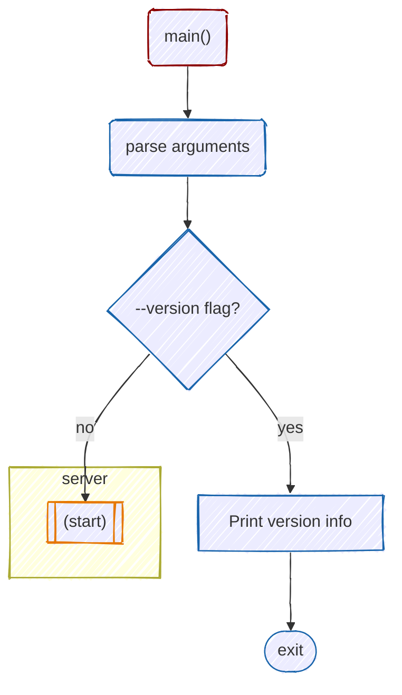
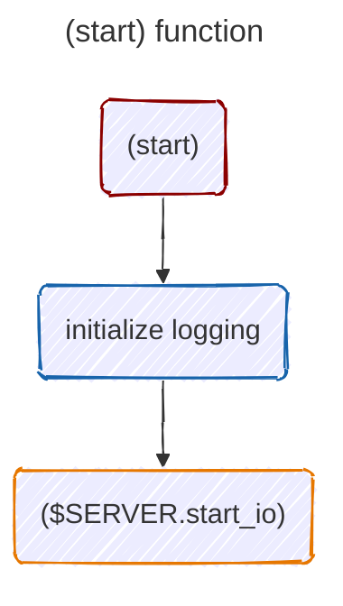
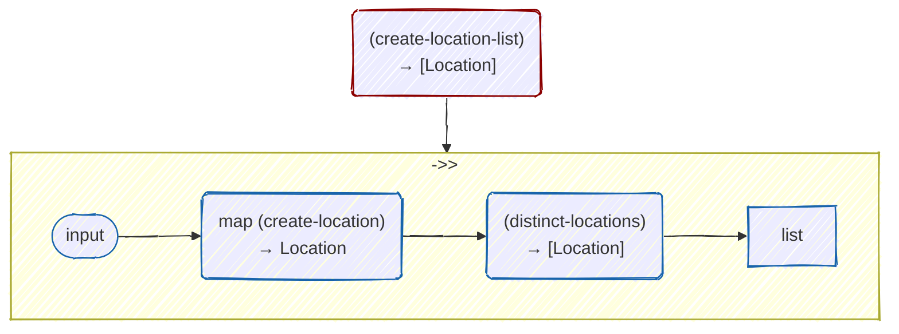
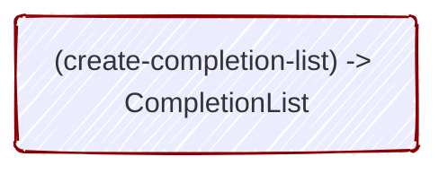
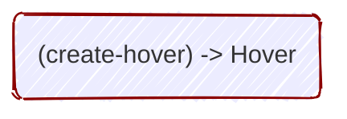

# Hyuga project structure diagrams

This document contains a series of [Mermaid](https://mermaid.js.org/) diagrams visually documenting the structure of Hyuga, along with some accompanying description/commentary.

## High-level module dependency map

The following diagram shows high-level module dependencies in the Hyuga project. Arrows indicate "imports" or "depends upon", as in: 

`(importing module) --depends upon--> (imported module)`

For simplicity, external module imports (which notably include hy, hyrule, lsprotocol, and pygls) are not shown. Also, nearly every module loads the `logging` and `sym.helper` modules. For simplicity of the diagram, those two "common" modules are not shown below.

`server`, `api`, and `sym.loader` are the most important modules in the project, so they are color-coded orange.

## Top-level Modules

### `__main__.py`

Hyuga's entry point is the [`main`](/hyuga/__main__.py#L7) function in [`__main__.py`](/hyuga/__main__.py).

That function, which is called at the bottom of `__main__/py` (only if `__name__` = `"__main__"`), parses command line arguments using `argparse` and checks whether the `--version` flag has been passed to the program at the command line. 
    If so, it prints a version string and exits.
    Otherwise, it calls the [`start`](/hyuga/server.hy#114) function from [`server.hy`](/hyuga/server.hy), which initiates the LSP.

#### `main()` function

### `server.hy`

[`server.hy`](/hyuga/server.hy), as well as defining several functions of its own, imports [lsprotocol](), [pygls](), and the other modules in Hyuga. 

The most important feature of `server.hy` is the `$SERVER` object, which is a `LanguageServer` as defined by the [pygls]() library.

The following symbols are defined by [lsprotocol]() in `lsprotocol.types`:

- TEXT_DOCUMENT_COMPLETION
- TEXT_DOCUMENT_HOVER
- TEXT_DOCUMENT_DEFINITION
- TEXT_DOCUMENT_DID_OPEN
- TEXT_DOCUMENT_DID_CLOSE
- TEXT_DOCUMENT_DID_CHANGE

### `api.hy`

### `cursor.hy`

### `global.hy`

### `lspspec.hy`

### `version.hy`

### `log.hy`

## `sym` Modules

### `sym/loader.hy`

### `sym/filter.hy`

### `sym/dummy.hy`

### `sym/doc.hy`

### `sym/helper.hy`

## `uri` Modules

### `uri/helper.hy`

