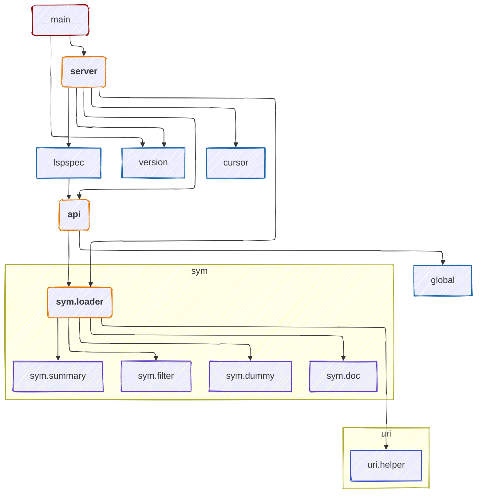

# Hyuga project structure diagrams

This document contains a series of [Mermaid](https://mermaid.js.org/) diagrams visually documenting the structure of Hyuga, along with some accompanying description/commentary.

## High-level module dependency map

The following diagram shows high-level module dependencies in the Hyuga project. Arrows indicate "imports" or "depends upon", as in: 

`(importing module) —depends upon→ (imported module)`

For simplicity, external module imports (which notably include [hy](https://hylang.org/), [hyrule](https://hylang.org/hyrule/doc/v0.7.0), [lsprotocol](https://github.com/microsoft/lsprotocol), and [pygls](https://github.com/openlawlibrary/pygls)) are not shown. Also, nearly every module loads the `logging` and `sym.helper` modules. For simplicity of the diagram, those two "common" modules are not shown below.

`server`, `api`, and `sym.loader` are the most important modules in the project, so they are color-coded orange.

## Module Documentation ToC

Function diagrams and documentation for individual modules can be found on the following pages:

- [\_\_main\_\_.py](__main__.md)
- [api.hy](api.md)
- [cursor.hy](cursor.md)
- [global.hy](global.md)
- [log.hy](log.md)
- [lspspec.hy](lspspec.md)
- [server.hy](server.md)
- [version.hy](version.md)
- [`sym` submodule](sym/index.md)
  - [doc.hy](sym/doc.md)
  - [dummy.hy](sym/dummy.md)
  - [filter.hy](sym/filter.md)
  - [helper.hy](sym/helper.md)
  - [loader.hy](sym/loader.md)
  - [summary.hy](sym/summary.md)
- [`uri` submodule](uri/index.md)
  - [helper.hy](uri/helper.md)
