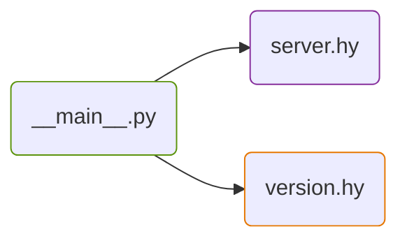
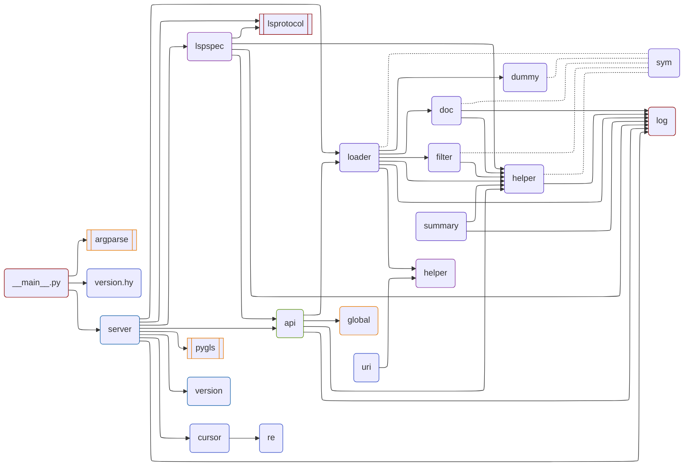

```mermaid
graph LR

%% Style Classes
classDef violet stroke:#862e9c
classDef purple stroke:#5f3dc4
classDef indigo stroke:#364fc7
classDef blue stroke:#1864ab
classDef green stroke:#5c940d
classDef orange stroke:#e67700

%% Entities
id0(__main__.py):::green

id1(server.hy):::violet 
id2(version.hy):::orange

%% Relationships
id0 --> id1
id0 --> id2
```

```mermaid
%%{init: {"flowchart": {"defaultRenderer": "elk"}} }%%
graph LR

%% Style Classes
classDef violet stroke:#862e9c
classDef purple stroke:#5f3dc4
classDef indigo stroke:#364fc7
classDef blue stroke:#1864ab
classDef green stroke:#5c940d
classDef orange stroke:#e67700
classDef red stroke:#8b0000

%% Entities
root(__main__.py):::red

id1[[argparse]]:::orange
id2(version.hy):::indigo
id3(server):::blue

    id3.7(lspspec):::violet
    id3.1[[lsprotocol]]:::red
    id3.2[[pygls]]:::orange
    id3.3(api):::green
    id3.4(version):::blue
    id3.5(sym):::purple

        id3.5.0(loader):::purple
        id3.5.1(doc):::purple
        id3.5.2(dummy):::purple
        id3.5.3(filter):::purple
        id3.5.4(helper):::purple
        id3.5.5(summary):::purple

    id3.6(cursor):::indigo

        id3.6.0(re):::indigo


    id3.8(log):::red

        %% id3.8.0[[logging]]:::red
        %% id3.8.1[[traceback]]:::red
        %% id3.8.2[[os.path]]:::red
        %% id3.8.3[[tempfile]]:::red

    id3.9(global):::orange

    id3.10(uri):::indigo

        id3.10.0(helper):::violet

%% Relationships
root --> id3
root --> id2
root --> id1 

id3 --> id3.1
id3 --> id3.2
id3 --> id3.3
id3 --> id3.4
id3 --> id3.5.0
id3 --> id3.6
id3 --> id3.7
id3 --> id3.8

id3.3 --> id3.8
id3.3 --> id3.9
id3.3 --> id3.5.0
id3.3 --> id3.5.4

id3.6 --> id3.6.0

id3.7 --> id3.1
id3.7 --> id3.8
id3.7 --> id3.3
id3.7 --> id3.5.4

%% id3.8 --> id3.8.0
%% id3.8 --> id3.8.1
%% id3.8 --> id3.8.2
%% id3.8 --> id3.8.3

id3.5.0 --> id3.8
id3.5.0 --> id3.5.1
id3.5.0 --> id3.5.2
id3.5.0 --> id3.5.3
id3.5.0 --> id3.5.4

id3.5.1 --> id3.8
id3.5.1 --> id3.5.4

id3.5.3 --> id3.5.4

id3.5.4 --> id3.8

id3.5.5 --> id3.5.4
id3.5.5 --> id3.8

id3.5.1 -.- id3.5
id3.5.2 -.- id3.5
id3.5.3 -.- id3.5
id3.5.4 -.- id3.5
id3.5.0 -.- id3.5

id3.5.0 --> id3.10.0

id3.10 --> id3.10.0

```
