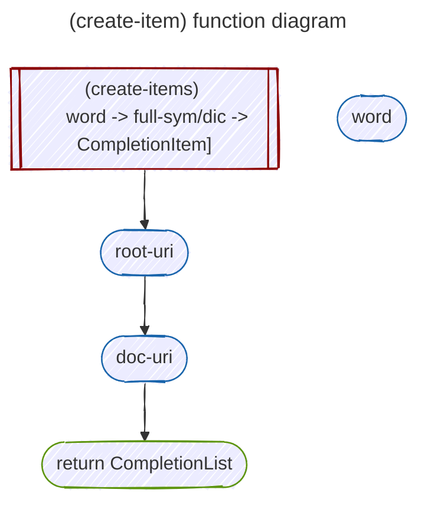
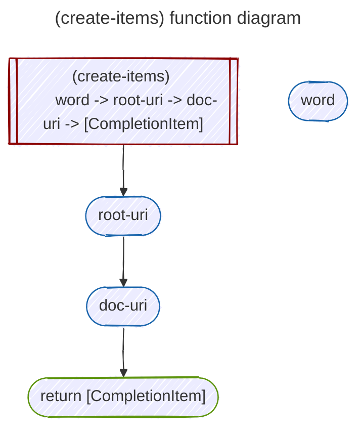
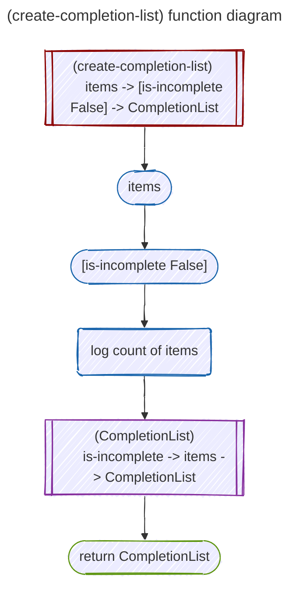
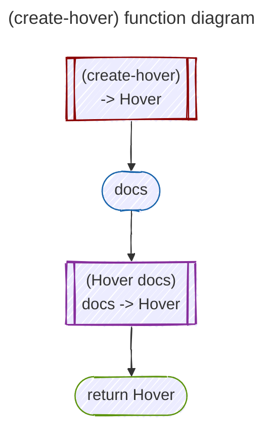
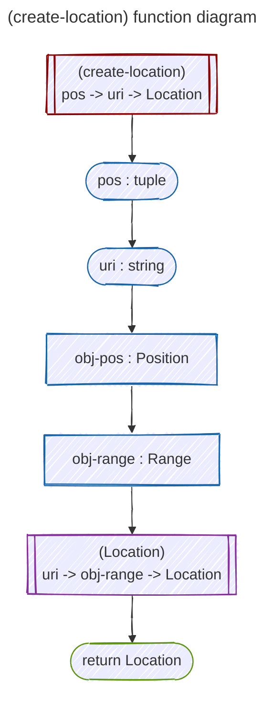

# `lspspec.hy` function diagrams and documentation

## `fix-dummy` function diagram

## `decide-kind-by-summary` function diagram

## `decide-kind-by-type` function diagram

## `decide-kind` function diagram

## `create-item` function diagram

## `create-items` function diagram

## `create-completion-list` function diagram

## `create-hover` function diagram

## `create-location` function diagram

## `distinct-locations` function diagram 

```mermaid
---
title: (distinct-locations) function diagram
config:
    look: handDrawn
---
graph TD

%% Style Classes
classDef violet stroke:#862e9c
classDef purple stroke:#5f3dc4
classDef indigo stroke:#364fc7
classDef blue stroke:#1864ab
classDef green stroke:#5c940d
classDef orange stroke:#e67700
classDef red stroke:#8b0000

%% Nodes

dl[["(distinct-locations) 
     [Location]  → [Location]"]]:::red
input(["items : [Location]"]):::blue
ret["ret : [Location]"]:::blue

subgraph id ["for [item items]"]
    %% direction LR
    
    if{item in ret?}:::blue
    put("add item to ret"):::blue
    continue(["continue"]):::blue
end

return(["return ret : [Location]"]):::green

%% Relationships

dl --> input --> ret --> id --> return

if -->|yes| continue
if -->|no| put --> continue

```

## `create-location-list` function diagram

```mermaid
---
title: (create-location-list) function diagram
config:
    look: handDrawn
---
graph TD

%% Style Classes
classDef violet stroke:#862e9c
classDef purple stroke:#5f3dc4
classDef indigo stroke:#364fc7
classDef blue stroke:#1864ab
classDef green stroke:#5c940d
classDef orange stroke:#e67700
classDef red stroke:#8b0000

%% Nodes

cll[["(create-location-list) 
     [[sym val]]  → [Location]"]]:::red

subgraph id ["->>"]
    direction LR
    input([input]):::blue
    cl("map (create-location) 
        → Location"):::blue
    dl("(distinct-locations) 
        → [Location]"):::blue
    list:::blue
end

%% Relationships

cll --> id

input --> cl --> dl --> list

```

