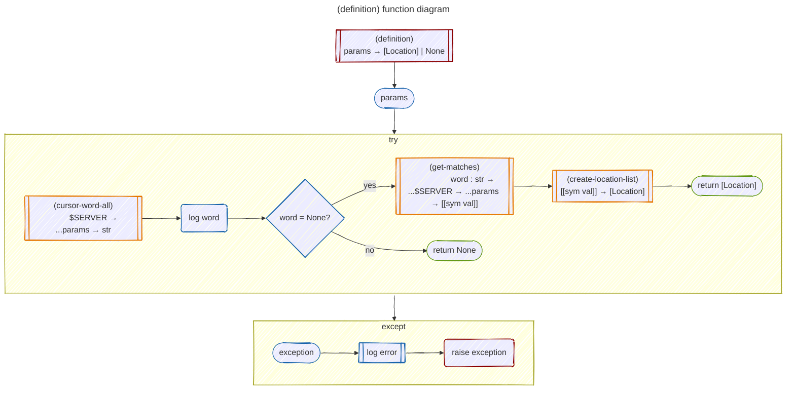
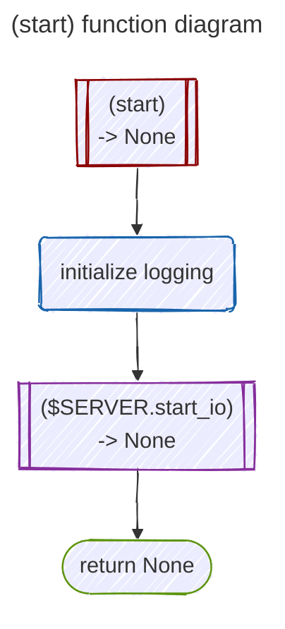

# `server.hy` function diagrams and documentation

[`server.hy`](/hyuga/server.hy), as well as defining several functions of its own, imports [lsprotocol](), [pygls](https://github.com/openlawlibrary/pygls), and the other modules in Hyuga. 

The most important feature of `server.hy` is the `$SERVER` object, which is a `LanguageServer` as defined by the [pygls](https://github.com/openlawlibrary/pygls) library.

The following symbols are defined by [lsprotocol]() in `lsprotocol.types`:

- TEXT_DOCUMENT_COMPLETION
- TEXT_DOCUMENT_HOVER
- TEXT_DOCUMENT_DEFINITION
- TEXT_DOCUMENT_DID_OPEN
- TEXT_DOCUMENT_DID_CLOSE
- TEXT_DOCUMENT_DID_CHANGE

## `completion` function diagram

## `hover` function diagram

## `definition` function diagram

## `did-open` function diagram

## `did-close` function diagram

## `did-change` function diagram

## `start` function diagram

